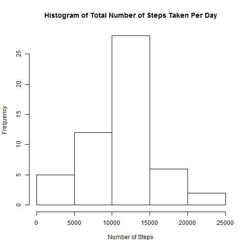
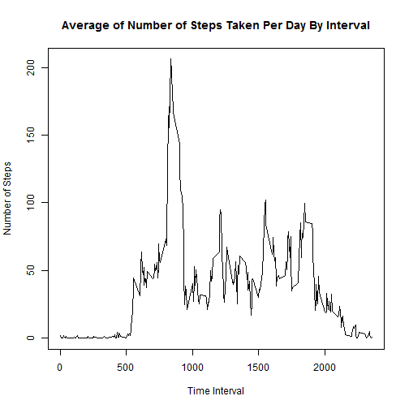
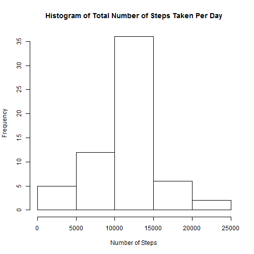
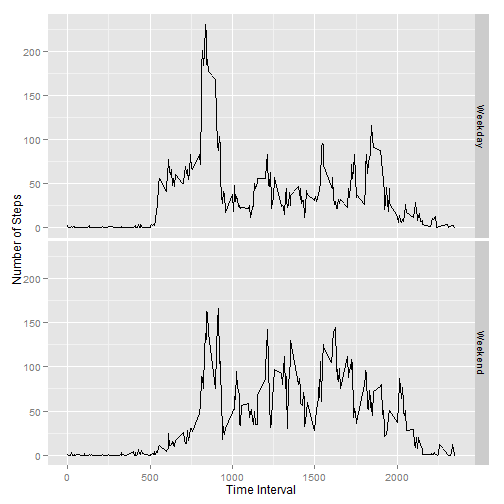

## About This Assignment

Fitbit, Nike Fuelband and other such wearable devices provide data. Here, 
simple analysis has been provided on the data provided by them. The data 
consisted of the number of steps taken in a day spaced in five-minute intervals.

## About the Data

The data was procured from here:
Dataset: [Activity monitoring data](https://d396qusza40orc.cloudfront.net/repdata%2Fdata%2Factivity.zip) [52K]

The variables included in this dataset are:

* **steps**: Number of steps taking in a 5-minute interval (missing values are coded as NA)

* **date**: The date on which the measurement was taken in YYYY-MM-DD format

* **interval**: Identifier for the 5-minute interval in which measurement was taken

The dataset is stored in a comma-separated-value (CSV) file and there are a 
total of 17,568 observations in this dataset.

## Data Analysis

### Loading and preprocessing the data
The dataset was downloaded and extracted from the zip file. This provided a CSV
file `activity.csv`, which was then read into R.


```r
data <- read.csv("activity.csv")
```

### What is mean total number of steps taken per day?
The sum of the steps on a day is caluclated and a histogram is made from the 
data.


```r
x <- aggregate(data$steps, by = list(Date = data$date), FUN = sum)
hist(x$x, main = paste("Histogram of Total Number of Steps Taken Per Day"),
     xlab = "Number of Steps")
```

 


```r
mean1 <- mean(x$x, na.rm = TRUE)
median1 <- median(x$x, na.rm = TRUE)
```

The mean is 1.0766 &times; 10<sup>4</sup> and median is 10765.

### What is the average daily activity pattern?
All missing values from the data are removed and mean number of steps per 
interval is caluclated and plotted as a time series plot.


```r
# Removing missing values
data2 <- data[with(data, order(interval)),]
data2 <- data2[complete.cases(data2),]

# Creating a data frame with mean values for each interval.
y <- aggregate(data2$steps[complete.cases(data2$steps)], 
               by = list(interval = data2$interval), FUN = mean)

# Plotting final data.
plot(y, type = "l", xlab = "Time Interval", ylab = "Number of Steps", 
     main = paste("Average of Number of Steps Taken Per Day By Interval"))
```

 

The time interval with maximum number of steps is found.

```r
maxsteps <- y$interval[which(y$x == max(y$x))]
```

The time interval is 835.

### Imputing missing values
The total number of missing values is calculated.


```r
totalna <- sum(!complete.cases(data))
```

2304 values are missing from the dataset.

These missing values are replaced by the mean of the number of steps of that 
day, then plotted against the time interval.


```r
library("plyr")
# Replacing missing values.
data3 <- data[with(data, order(interval)),]
replacena <- function(x) replace(x, is.na(x), mean(x, na.rm = TRUE))
data3 <- ddply(data3, ~ interval, transform, steps = replacena(steps))
data3 <- data3[order(data3$interval),]

# Creating a data frame with sum of number of steps per interval.
z <- aggregate(data3$steps, by = list(Date = data3$date), FUN = sum)

# Plotting the final data.
hist(z$x, main = paste("Histogram of Total Number of Steps Taken Per Day"),
     xlab = "Number of Steps")
```

 

The mean and median of this new dataset is calculated.


```r
mean2 <- mean(z$x, na.rm = TRUE)
median2 <- median(z$x, na.rm = TRUE)
```

The mean is 1.0766 &times; 10<sup>4</sup> and median is 1.0766 &times; 10<sup>4</sup>.

The difference between the mean of this data and the previous data is 
0. 

The difference between the medians of this data and the previous data is 
1.1887. 

The difference between the total number of steps in the datasets is 
8.613 &times; 10<sup>4</sup>.

### Are there differences in activity patterns between weekdays and weekends?

Steps were plotted against interval in different plots for weekdays and 
weekends.


```r
# Indentifcation of day as a weekday or weekend.
weekend <- c("Saturday", "Sunday")

data3$daytype = as.factor(ifelse(is.element(weekdays(as.Date(data3$date))
                                            ,weekend), "Weekend", "Weekday"))

# A data frame with mean number of steps, time interval and day type 
# (weekend/weekday) is created. 
stepsbyday <- aggregate(steps ~ interval + daytype, data3, mean)

# Plottinf the final data.
library("ggplot2")
g <- ggplot(stepsbyday, aes(interval, steps))
p <- g + geom_line() + facet_grid(daytype ~.) + xlab("Time Interval")
p <- p + ylab("Number of Steps")
print(p)
```

 

While the general trend seems to be same, it is seen that a higher peak is
observed during weekdays.
